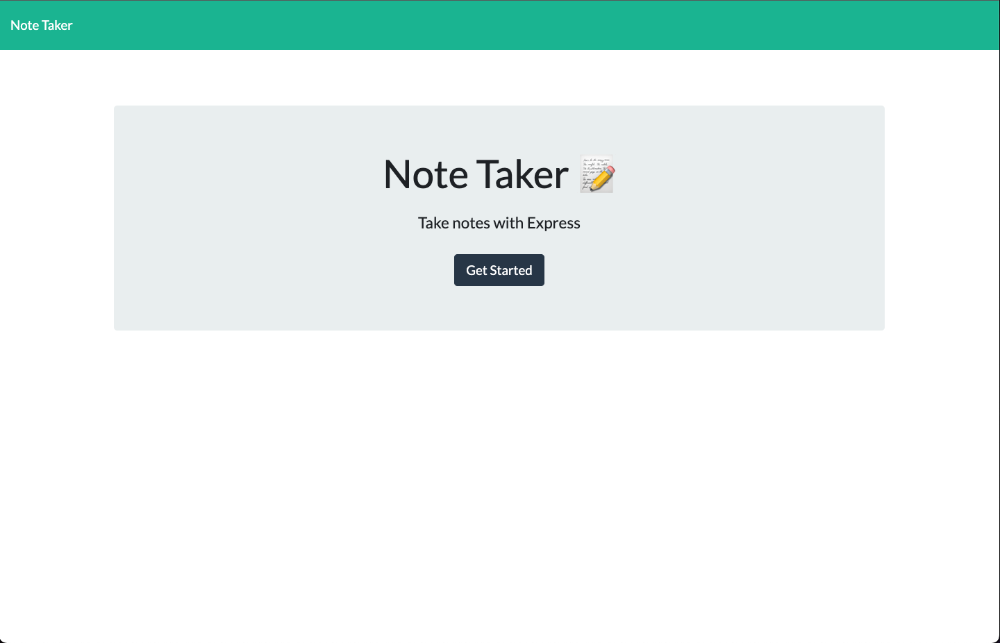
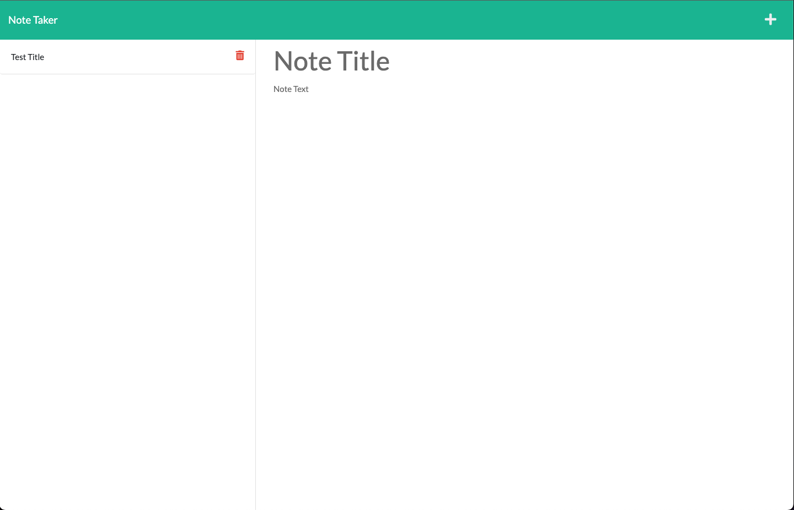
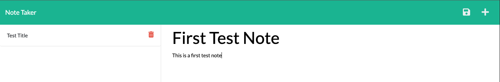
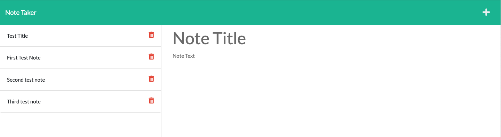

# Note-Taker
An application called Note Taker that can be used to write and save notes. This application will use an Express.js back end and will save and retrieve note data from a JSON file.

To give the application on Heroku click here: [View application on Heroku](https://tajdinov-note-taker.herokuapp.com/)

## Table of Contents
- [Installation](#installation)
- [Usage](#usage)
- [Features](#features)

## Installation
Once the user has cloned the project from GitHub there are a few steps they must undertake in order to get the application running. 
They must first open the command line and then type in 'npm install' or 'npm i'. This will download the neccessary dependencies so that the application functions. 

## Usage
To use the application the user can simply click on the link to view the application: https://tajdinov-note-taker.herokuapp.com

This will take them to the homepage. 

The user can then click "Get Started" and be re-directed to a new page which allows them to take notes. 

They will be displayed with the following page with 'no saved notes'. 

The user can enter a note title and note text, and select the floopy disc in the top right corner to save the note. 

The process can be repeated and a number of notes can be saved. 

If you user wants to delete a note that simply click on the red bin and the note is removed. 
The user can also select the + icon at any time to start a new note. 

## Features
- Express.js
- UUID
